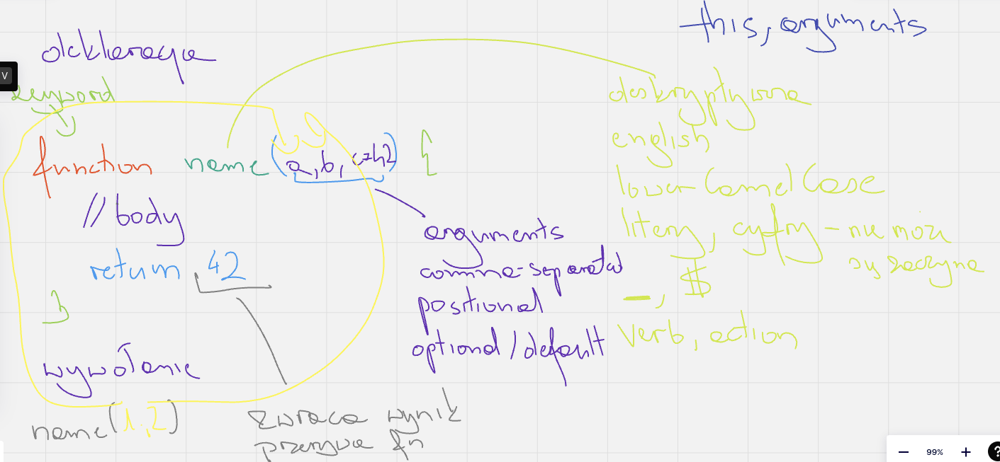

# JS notes

## Variables 

Rógiżnice |      var       | let | const
:---: |:--------------:| :---: | ---:
redeclaration | +(quirks mode) | -| -
re-assigment |       +        | + |-
hosting | + |+ (TDZ)| +(TDZ) 
scope | function| block | block

### Functions 

1. Named Functions
2. Anonymous Functions
    - classic
    - arrow functions

